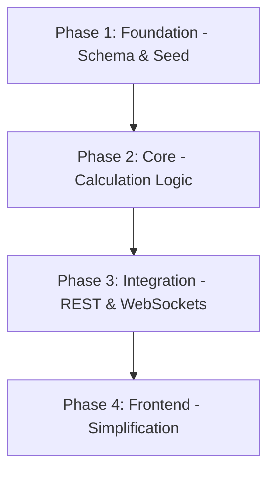

# Implementation Plan: Centralized Backend Spread Calculation

This plan centralizes spread and trend calculations in the backend, enriching the database schema to support future complex acquisition types (STOCK, MIXED) and simplifying the frontend state management.

## Plan Overview
- **Total Phases**: 4
- **Agents Involved**: `data_engineer`, `coder`, `refactor`, `tester`
- **Estimated Effort**: Medium

## Dependency Graph

## Execution Strategy Table
| Stage | Description | Agent(s) | Execution Mode |
|-------|-------------|----------|----------------|
| 1 | Foundation: Update Prisma schema and seed data | `data_engineer` | Sequential |
| 2 | Core: Implement multi-type calculation logic | `coder`, `tester` | Sequential |
| 3 | Integration: Enrich REST and WebSocket payloads | `coder` | Sequential |
| 4 | Frontend: Remove redundant logic and sync types | `refactor` | Sequential |

## Phase Details

### Phase 1: Foundation - Schema & Seed
**Objective**: Update the database schema to support multi-type acquisitions and provide diverse test data.

- **Agent Assignment**: `data_engineer` (Rationale: Focuses on schema and data integrity)
- **Files to Modify**:
  - `backend/db/schema.prisma`: Add `AcquisitionType` enum (CASH, STOCK, MIXED) and fields (`acquisitionType`, `cashAmount`, `exchangeRatio`) to the `Merger` model.
  - `backend/db/seed.ts`: Update seed data to include examples of all three acquisition types.
- **Implementation Details**:
  - `enum AcquisitionType { CASH, STOCK, MIXED }`
  - `Merger` model updates:
    - `acquisitionType AcquisitionType @default(CASH)`
    - `cashAmount Float?` (Only for MIXED/CASH)
    - `exchangeRatio Float?` (Only for MIXED/STOCK)
- **Validation Criteria**:
  - `npx prisma migrate dev --name add_acquisition_types` (Success)
  - `npx prisma db seed` (Success)
  - `npx prisma studio` (Manual check of updated records)

### Phase 2: Core - Calculation Logic
**Objective**: Revitalize `SpreadCalculatorService.ts` to handle multi-type spread and trend calculations.

- **Agent Assignment**: `coder`, `tester` (Rationale: `coder` implements, `tester` ensures formula accuracy)
- **Files to Modify**:
  - `backend/services/SpreadCalculatorService.ts`: Rewrite `calculateSpread` to handle different acquisition types using the formula:
    - `CASH`: `spread = ((offerPrice - currentPrice) / currentPrice) * 100`
    - `STOCK`: `spread = (((buyerPrice * exchangeRatio) - currentPrice) / currentPrice) * 100`
    - `MIXED`: `spread = ((((buyerPrice * exchangeRatio) + cashAmount) - currentPrice) / currentPrice) * 100`
- **Files to Create**:
  - `backend/tests/SpreadCalculatorService.test.ts`: Unit tests for all calculation scenarios.
- **Validation Criteria**:
  - `npm run test:backend` (Ensure 100% coverage on calculation logic)
- **Dependencies**: `blocked_by`: [1]

### Phase 3: Integration - REST & WebSockets
**Objective**: Enrich the REST and WebSocket payloads with pre-calculated spread and trend.

- **Agent Assignment**: `coder` (Rationale: Requires deep understanding of backend data flow)
- **Files to Modify**:
  - `backend/server.ts`: Update the `/api/mergers` endpoint to fetch current prices (via `FinnhubService`) and calculate the spread/trend for each merger before returning.
  - `backend/sockets/PriceEmitter.ts`: Update `handlePriceUpdate` to calculate the spread and trend for the emitted ticker.
  - `backend/sockets/SocketServer.ts`: Ensure `emitPriceUpdate` includes `spread` and `trend` in its payload.
- **Implementation Details**:
  - Use `MergerService` or a cached merger map in `PriceEmitter` to access terms (cash, ratio, buyerTicker) instantly without per-tick DB queries.
- **Validation Criteria**:
  - Restart backend and verify `/api/mergers` returns JSON with `spread` and `trend`.
  - Listen to WebSocket `priceUpdate` and verify it contains `spread` and `trend`.
- **Dependencies**: `blocked_by`: [2]

### Phase 4: Frontend - Simplification
**Objective**: Remove redundant frontend logic and sync state management with the backend.

- **Agent Assignment**: `refactor` (Rationale: Specializes in clean state management and type safety)
- **Files to Modify**:
  - `frontend/src/features/arbitrage/types.ts`: Update the `Merger` and `PriceUpdate` types to explicitly include `spread` and `trend`.
  - `frontend/src/lib/store.ts`: Remove all spread calculation logic from `setMergers`, `updateMergerPrice`, and `updateMultiplePrices`.
  - `frontend/src/features/arbitrage/hooks/useMergerWebSocket.ts`: Ensure the received spread and trend are passed directly to the store.
- **Validation Criteria**:
  - `npm run lint:frontend` (Ensure no unused variables/types)
  - Verify Dashboard displays correct spread and trend without console errors.
- **Dependencies**: `blocked_by`: [3]

## File Inventory
| Phase | Action | Path | Purpose |
|-------|--------|------|---------|
| 1 | Modify | `backend/db/schema.prisma` | Add multi-type acquisition fields |
| 1 | Modify | `backend/db/seed.ts` | Populate diverse test data |
| 2 | Modify | `backend/services/SpreadCalculatorService.ts` | Multi-type calculation logic |
| 2 | Create | `backend/tests/SpreadCalculatorService.test.ts` | Validate formulas |
| 3 | Modify | `backend/server.ts` | Enrich REST response |
| 3 | Modify | `backend/sockets/PriceEmitter.ts` | Inject real-time calculation |
| 3 | Modify | `backend/sockets/SocketServer.ts` | Update WebSocket payload |
| 4 | Modify | `frontend/src/features/arbitrage/types.ts` | Sync shared types |
| 4 | Modify | `frontend/src/lib/store.ts` | Remove redundant logic |
| 4 | Modify | `frontend/src/features/arbitrage/hooks/useMergerWebSocket.ts` | Simplify WebSocket hook |

## Risk Classification
| Phase | Risk | Rationale |
|-------|------|-----------|
| 1 | LOW | Standard Prisma migration. |
| 2 | MEDIUM | Requires absolute formula precision for financial data. |
| 3 | MEDIUM | Potential performance impact on real-time price ticks if not cached correctly. |
| 4 | LOW | Straightforward refactoring of existing logic. |

## Execution Profile
- **Total phases**: 4
- **Parallelizable phases**: 0 (Highly sequential due to schema -> logic -> integration -> consumption chain)
- **Sequential-only phases**: 4
- **Estimated sequential wall time**: ~2-3 hours

Note: Native parallel execution currently runs agents in autonomous mode.
All tool calls are auto-approved without user confirmation.

| Phase | Agent | Model | Est. Input | Est. Output | Est. Cost |
|-------|-------|-------|-----------|------------|----------|
| 1 | `data_engineer` | Pro | 10,000 | 2,000 | $0.18 |
| 2 | `coder` | Pro | 15,000 | 3,000 | $0.27 |
| 3 | `coder` | Pro | 20,000 | 4,000 | $0.36 |
| 4 | `refactor` | Pro | 15,000 | 2,000 | $0.23 |
| **Total** | | | **60,000** | **11,000** | **$1.04** |
