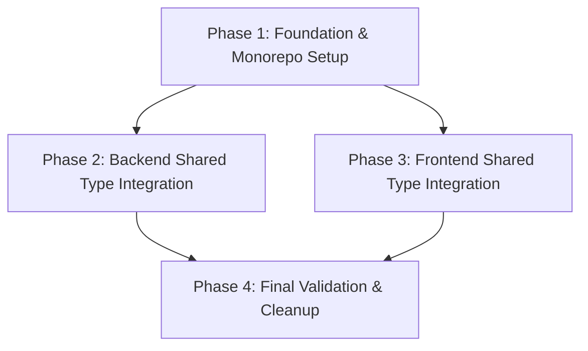

# Implementation Plan: Monorepo with Shared Type System

## 1. Plan Overview
Transition the project into a true NPM workspace-based monorepo, establish a shared `@arbimerge/shared` package for all common TypeScript types, and update both the backend and frontend to consume these shared types.

- **Total Phases**: 4
- **Agents Involved**: `refactor`, `coder`, `tester`
- **Estimated Effort**: Medium

## 2. Dependency Graph



## 3. Execution Strategy Table

| Stage | Phases | Agent(s) | Execution Mode |
|-------|--------|----------|----------------|
| **Foundation** | 1 | `refactor` | Sequential |
| **Implementation** | 2, 3 | `coder` | Parallel |
| **Validation** | 4 | `tester` | Sequential |

## 4. Phase Details

### Phase 1: Foundation & Monorepo Setup
**Objective**: Restructure the repository into a monorepo using NPM workspaces and create the initial shared package.

- **Agent Assignment**: `refactor`
- **Rationale**: Requires high-level structural changes to the file system and package configurations.
- **Files to Create**:
    - `package.json` (Root): Defines workspaces `["packages/*"]`.
    - `packages/shared/package.json`: Configures the `@arbimerge/shared` package.
    - `packages/shared/src/index.ts`: The entry point for all shared types and enums.
    - `packages/shared/tsconfig.json`: TypeScript configuration for the shared package.
- **Files to Modify/Move**:
    - Move `backend/` to `packages/backend/`.
    - Move `frontend/` to `packages/frontend/`.
    - Update `packages/backend/package.json`: Change name to `@arbimerge/backend` and update scripts.
    - Update `packages/frontend/package.json`: Change name to `@arbimerge/frontend` and update scripts.
- **Implementation Details**:
    - `packages/shared/src/index.ts` will initially include:
        ```typescript
        export enum TrendType {
          UP = 'UP',
          DOWN = 'DOWN',
          STABLE = 'STABLE'
        }
        export enum MergerStatus {
          ANNOUNCED = 'ANNOUNCED',
          PENDING = 'PENDING',
          COMPLETED = 'COMPLETED',
          CANCELLED = 'CANCELLED'
        }
        export enum AcquisitionType {
          CASH = 'CASH',
          STOCK = 'STOCK',
          MIXED = 'MIXED'
        }
        ```
- **Validation Criteria**:
    - `npm install` from root succeeds and creates symlinks in `node_modules`.
    - `ls packages/backend/node_modules/@arbimerge/shared` exists.
- **Dependencies**: None
- **Blocks**: [2, 3]

### Phase 2: Backend Shared Type Integration
**Objective**: Update the backend services to use the new shared types and establish the dependency on the shared package.

- **Agent Assignment**: `coder` (Backend)
- **Rationale**: Requires deep knowledge of backend services and TypeScript integration.
- **Files to Modify**:
    - `packages/backend/package.json`: Add `"@arbimerge/shared": "*"` to dependencies.
    - `packages/backend/tsconfig.json`: Ensure it can resolve the shared package.
    - `packages/backend/services/SpreadCalculatorService.ts`: Replace hardcoded string literals with `TrendType` enum.
    - `packages/backend/sockets/PriceEmitter.ts`: Use shared interfaces for WebSocket payloads.
- **Implementation Details**:
    - Update `getTrend` in `SpreadCalculatorService` to return `TrendType`.
    - Ensure `backend/db/schema.prisma` enums still match the `shared` enums.
- **Validation Criteria**:
    - `npm run build` in `packages/backend` succeeds.
    - `npm run test` (if available) passes.
- **Dependencies**: blocked_by: [1]
- **Blocks**: [4]

### Phase 3: Frontend Shared Type Integration
**Objective**: Update the frontend stores and components to use the shared types and establish the dependency on the shared package.

- **Agent Assignment**: `coder` (Frontend)
- **Rationale**: Requires knowledge of the frontend type system and UI components.
- **Files to Modify**:
    - `packages/frontend/package.json`: Add `"@arbimerge/shared": "*"` to dependencies.
    - `packages/frontend/tsconfig.json` (and sub-configs): Update for workspace imports.
    - `packages/frontend/src/features/arbitrage/types.ts`: Remove local definitions of `TrendType`, `MergerStatus`, etc.
    - `packages/frontend/src/lib/store.ts`: Use shared `TrendType` in store updates.
    - `packages/frontend/src/features/arbitrage/components/MergerCard.tsx`: Update any UI logic relying on trend strings.
- **Implementation Details**:
    - Import `TrendType`, `MergerStatus`, and `AcquisitionType` from `@arbimerge/shared`.
    - Clean up all manual string unions in `types.ts`.
- **Validation Criteria**:
    - `npm run build` in `packages/frontend` succeeds.
    - UI correctly renders trend indicators (UP/DOWN/STABLE) using the shared enums.
- **Dependencies**: blocked_by: [1]
- **Blocks**: [4]

### Phase 4: Final Validation & Cleanup
**Objective**: Perform a complete end-to-end check and clean up any remaining artifacts.

- **Agent Assignment**: `tester`
- **Rationale**: Independent verification of the entire system.
- **Files to Modify**: None
- **Implementation Details**:
    - Run both backend and frontend concurrently from the root (if root scripts are available).
    - Verify real-time price updates over WebSocket.
    - Perform a final comparison between `schema.prisma` and `packages/shared/src/index.ts`.
- **Validation Criteria**:
    - Application is fully functional with no console errors or build warnings.
    - Real-time data flow is verified across the shared type boundary.
- **Dependencies**: blocked_by: [2, 3]

## 5. File Inventory

| Phase | Action | Path | Purpose |
|-------|--------|------|---------|
| 1 | Create | `package.json` (Root) | Monorepo workspace config |
| 1 | Create | `packages/shared/package.json` | Shared package definition |
| 1 | Create | `packages/shared/src/index.ts` | Source of truth for types |
| 1 | Create | `packages/shared/tsconfig.json` | Shared package TS config |
| 1 | Move | `packages/backend/` | Refactored backend location |
| 1 | Move | `packages/frontend/` | Refactored frontend location |
| 2 | Modify | `packages/backend/services/SpreadCalculatorService.ts` | Integration of `TrendType` |
| 3 | Modify | `packages/frontend/src/features/arbitrage/types.ts` | Integration of shared types |

## 6. Risk Classification

| Phase | Risk | Rationale |
|-------|------|-----------|
| 1 | HIGH | Moving directories can break relative paths in imports and scripts. |
| 2 | MEDIUM | Enum vs String mismatch could lead to runtime errors in calculation logic. |
| 3 | MEDIUM | Build tool resolution issues with Vite and NPM workspaces. |
| 4 | LOW | Minor cleanup and verification. |

## 7. Execution Profile

- **Total phases**: 4
- **Parallelizable phases**: 2 (Phases 2 & 3)
- **Sequential-only phases**: 2 (Phases 1 & 4)
- **Estimated parallel wall time**: ~20-30 minutes
- **Estimated sequential wall time**: ~45-60 minutes

## 8. Cost Estimation

| Phase | Agent | Model | Est. Input | Est. Output | Est. Cost |
|-------|-------|-------|-----------|------------|----------|
| 1 | `refactor` | Gemini 1.5 Pro | 15,000 | 5,000 | $0.35 |
| 2 | `coder` | Gemini 1.5 Pro | 10,000 | 3,000 | $0.22 |
| 3 | `coder` | Gemini 1.5 Pro | 10,000 | 3,000 | $0.22 |
| 4 | `tester` | Gemini 1.5 Pro | 5,000 | 1,000 | $0.09 |
| **Total** | | | **40,000** | **12,000** | **$0.88** |
