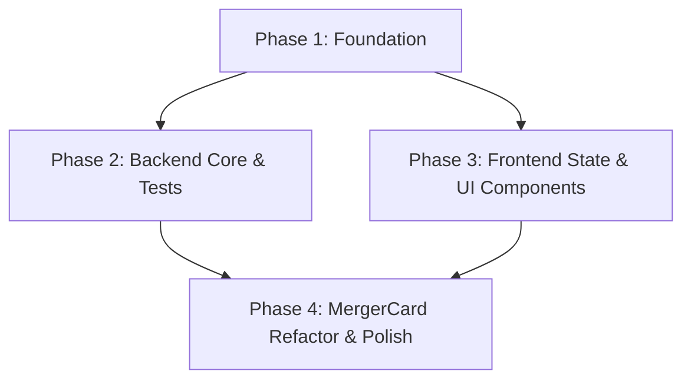

# Implementation Plan: MergerCard Display Improvement

## 1. Plan Overview
This plan outlines the implementation of the `MergerCard` display improvements, including the addition of `buyerPrice` to the real-time data flow, contextual timestamp relocation, and deal composition explanations.

- **Total Phases**: 4
- **Agents Involved**: `api_designer`, `coder`, `ux_designer`, `tester`
- **Estimated Effort**: Moderate (Medium complexity)

## 2. Dependency Graph

## 3. Execution Strategy Table

| Stage | Phases | Agent(s) | Mode |
|-------|--------|----------|------|
| 1 | Phase 1 | `api_designer` | Sequential |
| 2 | Phase 2, Phase 3 | `coder`, `ux_designer` | Parallel (non-overlapping files) |
| 3 | Phase 4 | `ux_designer` | Sequential |

## 4. Phase Details

### Phase 1: Foundation (Shared Types & Backend API)
- **Objective**: Update shared types and the backend socket emission logic to include `buyerPrice` with explicit naming.
- **Agent**: `api_designer`
- **Files to Modify**:
    - `packages/frontend/src/features/arbitrage/types.ts`: Update `Merger` (add `buyerPrice: number | null`) and `PriceUpdate` (add `targetPrice: number` and `buyerPrice: number | null`).
    - `packages/backend/sockets/SocketServer.ts`: Rename `price` parameter to `targetPrice` and add `buyerPrice: number | null` to `emitPriceUpdate`. Update the emitted event payload.
- **Validation**:
    - `npm run build` in `packages/backend/` and `packages/frontend/` to ensure no type regressions.

### Phase 2: Backend Core & Validation
- **Objective**: Ensure the backend correctly identifies and sends both prices for all relevant mergers. Update existing backend tests.
- **Agent**: `coder`
- **Files to Modify**:
    - `packages/backend/sockets/PriceEmitter.ts`: Update `handlePriceUpdate` to extract and send both `targetPrice` and `buyerPrice`. Update `getAllLastPrices` to include `buyerPrice`.
    - `packages/backend/tests/mergerUtils.test.ts`: Update test cases to match the new `PriceUpdate` structure.
    - `packages/backend/tests/SpreadCalculatorService.test.ts`: Update test cases to match the new `PriceUpdate` structure.
- **Validation**:
    - `npm run test` in `packages/backend/`.

### Phase 3: Frontend State & UI Components
- **Objective**: Update the Zustand store to handle the new `priceUpdate` structure and create the reusable label components.
- **Agent**: `coder`
- **Files to Create**:
    - `packages/frontend/src/features/arbitrage/components/ContextLabel.tsx`: A small reusable component for contextual timestamps and deal component explanations.
- **Files to Modify**:
    - `packages/frontend/src/lib/store.ts`: Update `updateMergerPrice` to handle the new `targetPrice` and `buyerPrice` fields in the `PriceUpdate` object.
    - `packages/frontend/src/features/arbitrage/hooks/useMergerWebSocket.ts`: Update the `priceUpdate` event listener to extract the new fields.
- **Validation**:
    - `npm run lint` in `packages/frontend/`.

### Phase 4: MergerCard Refactor & Polish
- **Objective**: Complete the `MergerCard` refactor: conditional pricing, relocated timestamps, and "Cash Component" explanation.
- **Agent**: `ux_designer`
- **Files to Modify**:
    - `packages/frontend/src/features/arbitrage/components/MergerCard.tsx`:
        - Remove bottom timestamp badges.
        - Add `ContextLabel` for target price timestamp.
        - Add conditional `buyerPrice` display with `ContextLabel` for its timestamp (for `STOCK`/`MIXED` deals).
        - Add conditional "Cash Component" explanation below `OFFER VALUE` (for `MIXED` deals).
        - Ensure flash animations work for both prices.
- **Validation**:
    - `npm run lint` in `packages/frontend/`.
    - Manual verification of the dashboard to ensure correct display logic for different deal types.

## 5. File Inventory

| Phase | Action | Path | Purpose |
|-------|--------|------|---------|
| 1 | Modify | `packages/frontend/src/features/arbitrage/types.ts` | Update core data interfaces |
| 1 | Modify | `packages/backend/sockets/SocketServer.ts` | Update socket event signature |
| 2 | Modify | `packages/backend/sockets/PriceEmitter.ts` | Update price processing and emission |
| 2 | Modify | `packages/backend/tests/mergerUtils.test.ts` | Update backend tests |
| 2 | Modify | `packages/backend/tests/SpreadCalculatorService.test.ts` | Update backend tests |
| 3 | Create | `packages/frontend/src/features/arbitrage/components/ContextLabel.tsx` | New reusable UI component |
| 3 | Modify | `packages/frontend/src/lib/store.ts` | Update state management |
| 3 | Modify | `packages/frontend/src/features/arbitrage/hooks/useMergerWebSocket.ts` | Update socket listener |
| 4 | Modify | `packages/frontend/src/features/arbitrage/components/MergerCard.tsx` | Complete UI refactor |

## 6. Risk Classification

| Phase | Risk | Rationale |
|-------|------|-----------|
| 1 | LOW | Simple type and interface updates. |
| 2 | MEDIUM | Requires careful handling of price tick logic to ensure both prices are synced correctly. |
| 3 | LOW | Store update is straightforward; new component is small. |
| 4 | MEDIUM | Complex UI logic for conditional rendering and responsive layout. |

## 7. Execution Profile
- **Total phases**: 4
- **Parallelizable phases**: 2 (Phase 2 and Phase 3)
- **Sequential-only phases**: 2
- **Estimated parallel wall time**: 3 phases (1 -> [2,3] -> 4)
- **Estimated sequential wall time**: 4 phases

Note: Native parallel execution currently runs agents in autonomous mode.
All tool calls are auto-approved without user confirmation.

## 8. Cost Estimation

| Phase | Agent | Model | Est. Input | Est. Output | Est. Cost |
|-------|-------|-------|-----------|------------|----------|
| 1 | `api_designer` | Pro | 3000 | 1000 | $0.07 |
| 2 | `coder` | Pro | 5000 | 2000 | $0.13 |
| 3 | `coder` | Pro | 5000 | 2000 | $0.13 |
| 4 | `ux_designer` | Pro | 6000 | 3000 | $0.18 |
| **Total** | | | **19000** | **8000** | **$0.51** |
