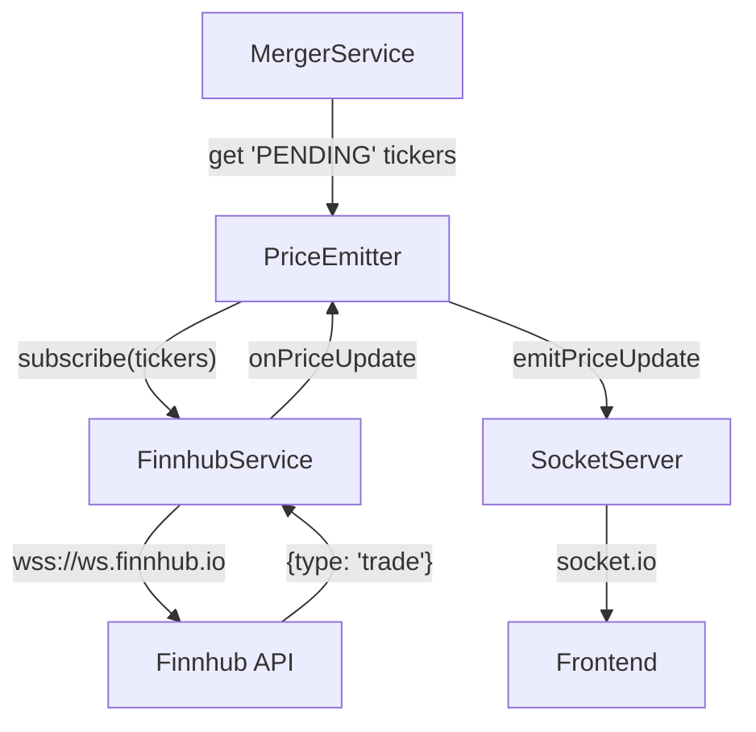

# Design: Finnhub WebSocket Price Integration

## 1. Problem Statement

The current `YahooFinanceService` integration in the `arbiMerge` backend is non-functional due to changes in Yahoo Finance's cookie policies. This has broken the real-time price feed for 'PENDING' mergers. 

We need to replace the entire Yahoo Finance dependency with a new integration using the **Finnhub API**. The new solution must use **WebSockets** to provide live price updates for all tickers currently part of active mergers, ensuring the dashboard remains reactive and accurate.

## 2. Requirements

### Functional Requirements
- **Connect to Finnhub WebSockets**: Establish a persistent connection to `wss://ws.finnhub.io` using a `FINNHUB_API_KEY`. [Traces To: REQ-1]
- **Always Active Strategy**: Connect on backend startup and maintain subscriptions for all 'PENDING' tickers. [Traces To: REQ-2]
- **Dynamic Subscriptions**: Subscribe to all ticker symbols involved in 'PENDING' mergers. [Traces To: REQ-3]
- **Real-time Price Updates**: Broadcast price changes (`type: 'trade'`) to connected clients via the existing `SocketServer`. [Traces To: REQ-4]

### Non-Functional Requirements
- **Persistent Connection**: Implement automatic reconnection logic for the Finnhub WebSocket to handle network drops. [Traces To: REQ-5]
- **Resource Efficiency**: Maintain subscriptions only for tickers actively being tracked in 'PENDING' mergers. [Traces To: REQ-6]

### Constraints
- **Pure WebSocket**: Rely solely on Finnhub's WebSocket feed for price updates, with no REST-based fallback for initial prices. [Traces To: REQ-7]
- **Direct Library**: Use the standard `ws` Node.js library for implementation to maximize control over connection management. [Traces To: REQ-8]

## 3. Approach

### Selected Approach: Reactive WebSocket Integration

**Summary**: We will replace the current polling logic in `PriceEmitter` with a reactive system where `FinnhubService` maintains a live WebSocket connection to Finnhub and pushes updates through an `EventEmitter` to `PriceEmitter`.

**Architecture**:
- **FinnhubService (New)**: A singleton class that manages a single WebSocket (`wss://ws.finnhub.io`) using the `ws` library. It maintains a set of subscribed tickers and updates a local price cache whenever it receives a `type: 'trade'` message from Finnhub. It emits a `priceUpdate` event for each trade received.
- **PriceEmitter (Refactored)**: Instead of its current 5-second `setInterval` polling loop, `PriceEmitter` will listen to events from `FinnhubService`. When it receives an update, it will broadcast it to connected clients via `SocketServer`. On startup, it will fetch all 'PENDING' mergers from `MergerService` and tell `FinnhubService` to subscribe to their tickers.

**Pros**:
- **Real-time Updates**: Prices are updated as soon as trades occur on Finnhub, far faster than the previous 5-second poll.
- **Efficient Resource Usage**: No more repeated HTTP requests for prices.
- **Improved Responsiveness**: Clients see updates instantly, providing a more professional trading dashboard experience.

**Cons**:
- **Low-Volume Risk**: Tickers with no recent trades may show "N/A" or stale data until the next trade occurs (since we aren't using a REST fallback).
- **Complex Connection Management**: Requires robust handling for WebSocket drops and re-authentication.

**Best When**: Live, real-time data is the priority and the backend needs to scale to many tickers efficiently.

**Risk Level**: Medium

### Decision Matrix

| Criterion | Weight | Reactive WS | Polling Wrapper |
|-----------|--------|-------------|-----------------|
| Real-time Accuracy | 40% | 5: Updates pushed instantly as they occur. | 3: Limited by the 5s polling interval. |
| Implementation Ease | 20% | 3: Requires new reactive event handling and WS management. | 4: Closer to existing code, just a library swap. |
| Resource Efficiency | 20% | 5: Minimizes network overhead and API calls. | 2: Constant HTTP overhead for every ticker every 5s. |
| User Experience | 20% | 5: Dashboard feels live and active. | 3: Periodic jumps in data every 5s. |
| **Weighted Total** | | **4.6** | **3.0** |

## 4. Architecture

### Component Diagram

### Data Flow

1. **Startup**: `PriceEmitter` initializes, retrieves 'PENDING' tickers from `MergerService`, and subscribes to them via `FinnhubService`.
2. **Finnhub Connection**: `FinnhubService` establishes the WebSocket connection to `wss://ws.finnhub.io?token=API_KEY`.
3. **Trade Received**: When a trade occurs for a subscribed ticker, Finnhub sends a JSON message (`type: 'trade'`).
4. **Broadcast**: `FinnhubService` emits an event for the trade. `PriceEmitter` catches the event and calls `SocketServer.emitPriceUpdate()`.
5. **UI Update**: Connected frontend clients receive the `priceUpdate` event and update their dashboard in real-time.

### Key Interfaces

- **FinnhubService**:
  - `subscribe(symbol: string): void`: Adds a symbol to the set of tracked tickers and sends the `subscribe` message to Finnhub.
  - `unsubscribe(symbol: string): void`: Removes a symbol from the set of tracked tickers and sends the `unsubscribe` message to Finnhub.
  - `onPriceUpdate(callback: (symbol: string, price: number) => void): void`: Registers a listener for price updates.

- **PriceEmitter**:
  - `initialize(): void`: Fetches initial active tickers from `MergerService`, sets up the initial state and registers listeners for `FinnhubService` updates.
  - `handlePriceUpdate(symbol: string, price: number): void`: Formats and broadcasts the update via `SocketServer`.

## 5. Agent Team

| Role | Agent | Responsibility |
|------|-------|----------------|
| **Lead Developer** | `coder` | Implement `FinnhubService` and refactor `PriceEmitter`. |
| **Testing Specialist** | `tester` | Verify real-time price updates and reconnection logic. |
| **Code Reviewer** | `code_reviewer` | Perform final quality review of the implementation. |

## 6. Risk Assessment

| Risk | Impact | Mitigation |
|------|--------|------------|
| **Low-Volume Tickers**: Finnhub WebSockets only emit on trades. For some tickers, there may be long periods without any price updates. | High | **Mitigation**: `PriceEmitter` will maintain a `lastPrices` cache in memory. If no update has been received for a ticker, it will continue to show the last known price. We will log warnings for tickers with no trades received within 1 hour. |
| **WebSocket Disconnection**: Network instability could drop the persistent connection to Finnhub, stopping all price updates. | High | **Mitigation**: `FinnhubService` will implement an automatic reconnection strategy with exponential backoff. It will also re-subscribe to all active tickers upon successful reconnection. |
| **API Key Exposure**: Accidentally committing the `FINNHUB_API_KEY` to source control. | Medium | **Mitigation**: Ensure `FINNHUB_API_KEY` is added to `.env.example` but excluded from `.git` via `.gitignore`. |
| **Message Throughput**: High-volume market activity could lead to a flood of messages, potentially slowing down the backend event loop. | Low | **Mitigation**: `PriceEmitter` can implement a throttle (e.g., 500ms) to consolidate rapid-fire updates for the same ticker before broadcasting to clients, reducing UI rendering load. |

## 7. Success Criteria

- **Functional Connection**: Backend successfully connects to `wss://ws.finnhub.io`.
- **Active Subscriptions**: `FinnhubService` sends `subscribe` messages for all tickers of 'PENDING' mergers.
- **Price Emission**: Connected clients receive `priceUpdate` events via Socket.io when trades occur on Finnhub.
- **Automatic Reconnect**: The service successfully recovers and re-subscribes after a simulated network disruption.
