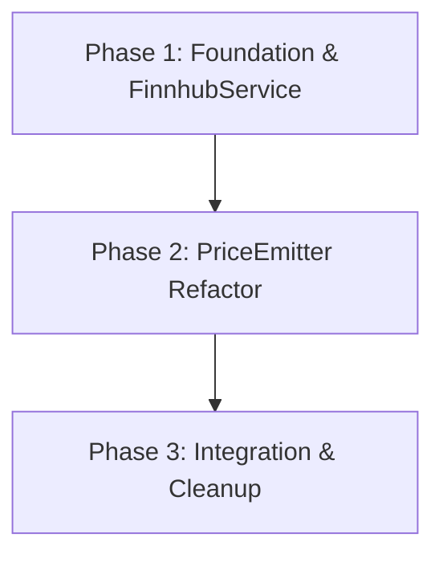

# Implementation Plan: Finnhub WebSocket Integration

## 1. Plan Overview
This plan outlines the replacement of the non-functional Yahoo Finance integration with a real-time Finnhub WebSocket price feed. 

- **Total Phases**: 3
- **Estimated Effort**: Medium
- **Primary Agents**: `coder`, `tester`

## 2. Dependency Graph

## 3. Execution Strategy
| Phase | Agent | Model | Status |
|-------|-------|-------|--------|
| 1 | `coder` | Pro | Sequential |
| 2 | `coder` | Pro | Sequential |
| 3 | `coder` | Pro | Sequential |
| 4 | `tester` | Flash | Sequential |

## 4. Phase Details

### Phase 1: Foundation & FinnhubService
**Objective**: Set up Finnhub API configuration and implement the core WebSocket service.

**Agent Assignment**: `coder` (requires implementation access)

**Files to Create**:
- `backend/services/FinnhubService.ts`:
  - Singleton class `FinnhubService`.
  - Manages a persistent WebSocket connection to `wss://ws.finnhub.io?token=API_KEY`.
  - Implements `subscribe(symbol: string)` and `unsubscribe(symbol: string)`.
  - Maintains an internal `Map<string, number>` for the latest prices.
  - Inherits from `EventEmitter` and emits `priceUpdate` for each trade message.
  - Implements automatic reconnection with exponential backoff.

**Files to Modify**:
- `backend/.env`: Add `FINNHUB_API_KEY`.
- `backend/.env.example`: Add `FINNHUB_API_KEY` placeholder.
- `backend/package.json`: Add `ws` dependency.

**Implementation Details**:
- Use `ws` library for the WebSocket client.
- Subscribe message: `{"type":"subscribe","symbol":"TICKER"}`.
- Parse `type: 'trade'` messages and extract `p` (price) and `s` (symbol).
- Reconnection logic: Start with 1s, double up to 60s. Re-subscribe all current symbols on reconnect.

**Validation Criteria**:
- `npm install ws` (backend)
- `npm run build` (backend)
- Successful connection message in logs.

**Dependencies**: None

---

### Phase 2: PriceEmitter Refactor
**Objective**: Refactor the backend to broadcast real-time updates from Finnhub instead of polling Yahoo Finance.

**Agent Assignment**: `coder`

**Files to Modify**:
- `backend/sockets/PriceEmitter.ts`:
  - Remove `setInterval` polling loop.
  - Initialize by fetching all 'PENDING' tickers from `MergerService`.
  - Subscribe to these tickers via `FinnhubService.subscribe()`.
  - Add listener to `FinnhubService.on('priceUpdate', ...)` that calls `SocketServer.emitPriceUpdate()`.
  - Implement a simple throttle (e.g., 500ms per ticker) to avoid overwhelming the frontend with rapid-fire updates.
  - Update `lastPrices` cache on each update.

**Implementation Details**:
- Keep the `lastPrices` cache as a safety net.
- Ensure `MergerService.getActiveMergers()` is called on startup to populate initial subscriptions.

**Validation Criteria**:
- No syntax errors.
- Unit tests for `PriceEmitter` (if they exist) should pass.

**Dependencies**: `blocked_by: [1]`

---

### Phase 3: Integration, Cleanup & Validation
**Objective**: Remove old code and verify system integrity.

**Agent Assignment**: `coder`

**Files to Modify**:
- `backend/test-batch-prices.ts`: Update to use `FinnhubService` or delete if obsolete.

**Files to Delete**:
- `backend/lib/yahooFinance.ts`
- `backend/services/YahooFinanceService.ts`

**Validation Criteria**:
- Full backend build passes.
- No remaining references to `yahooFinance` or `YahooFinanceService` in the codebase (except for logs/history).
- Manual verification: Start backend, add a 'PENDING' merger, and verify `priceUpdate` events in the logs or a test client.

**Dependencies**: `blocked_by: [2]`

---

## 5. File Inventory
| Phase | Action | Path | Purpose |
|-------|--------|------|---------|
| 1 | Create | `backend/services/FinnhubService.ts` | Core WebSocket management. |
| 1 | Modify | `backend/.env` | Configuration. |
| 1 | Modify | `backend/.env.example` | Configuration placeholder. |
| 1 | Modify | `backend/package.json` | Add `ws` dependency. |
| 2 | Modify | `backend/sockets/PriceEmitter.ts` | Switch to reactive updates. |
| 3 | Modify | `backend/test-batch-prices.ts` | Update test utility. |
| 3 | Delete | `backend/lib/yahooFinance.ts` | Old dependency. |
| 3 | Delete | `backend/services/YahooFinanceService.ts` | Old service. |

## 6. Risk Classification
| Phase | Risk | Rationale |
|-------|------|-----------|
| 1 | Medium | WebSocket stability and Finnhub connectivity are external dependencies. |
| 2 | Medium | Refactoring the core price broadcast logic could introduce regressions in UI stability. |
| 3 | Low | Cleanup is straightforward but requires careful dependency removal. |

## 7. Execution Profile
- **Total phases**: 3
- **Parallelizable phases**: 0 (sequential dependency on core service)
- **Sequential-only phases**: 3
- **Estimated sequential wall time**: 1-2 hours

## 8. Cost Estimate
| Phase | Agent | Model | Est. Input | Est. Output | Est. Cost |
|-------|-------|-------|-----------|------------|----------|
| 1 | `coder` | Pro | 3,000 | 1,500 | $0.09 |
| 2 | `coder` | Pro | 4,000 | 1,000 | $0.08 |
| 3 | `coder` | Pro | 3,000 | 500 | $0.05 |
| 4 | `tester` | Flash | 2,000 | 1,000 | $0.01 |
| **Total** | | | **12,000** | **4,000** | **$0.23** |
