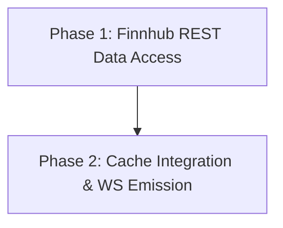

# Implementation Plan: Initial Price Synchronization

## Plan Overview
- **Total Phases**: 2
- **Agents Involved**: `coder`
- **Estimated Effort**: Low-Medium (small backend changes)

## Dependency Graph

## Execution Strategy Table
| Phase | Stage | Agent | Parallel | Execution Mode | Blocked By |
|-------|-------|-------|----------|----------------|------------|
| 1 | Core | `coder` | No | Sequential | - |
| 2 | Integration | `coder` | No | Sequential | 1 |

## Phase Details

### Phase 1: Finnhub REST Data Access
- **Objective**: Extend `FinnhubService` to fetch initial prices from the Finnhub REST `/quote` endpoint so we have baseline prices when the server starts and the market is closed.
- **Agent**: `coder` (Reason: Pure backend service implementation)
- **Files to Modify**:
  - `backend/services/FinnhubService.ts`: Add a `fetchInitialPrice(symbol: string)` method that uses native `fetch` to call `https://finnhub.io/api/v1/quote?symbol=${symbol}&token=${this.apiKey}`. It should map the `c` (current price) response to the `{ symbol, price, timestamp }` format. Handle rate-limits or fetch errors gracefully.
- **Implementation Details**:
  - The response from Finnhub `/quote` looks like `{"c": 150.5, "d": ..., "t": 161...}`. We need `c` (price) and `t` (timestamp).
  - Use native `fetch` (Node.js 18+).
  - Add a helper to fetch multiple symbols iteratively with a small delay if needed to avoid 429 Too Many Requests on free tier.
- **Validation Criteria**: Run the service standalone or with a unit test script to verify `fetchInitialPrice('AAPL')` returns the correct mapped object.
- **Dependencies**:
  - `blocked_by`: []
  - `blocks`: [2]

### Phase 2: Cache Integration & WS Emission
- **Objective**: Use the new REST fetch method during server startup to populate `PriceEmitter`'s cache, and update `SocketServer` to emit this cache to newly connected clients.
- **Agent**: `coder` (Reason: Wiring existing modules)
- **Files to Modify**:
  - `backend/sockets/PriceEmitter.ts`: Add an `initializeCache(symbols: string[])` method that calls `FinnhubService.fetchInitialPrice` for each symbol and stores it in `lastPrices`.
  - `backend/index.ts` (or `server.ts`): Call `PriceEmitter.getInstance().initializeCache(symbols)` with all active mergers on boot.
  - `backend/sockets/SocketServer.ts`: Inside the `io.on('connection', (socket) => { ... })` handler, iterate over `PriceEmitter.getInstance().getAllLastPrices()` and send `socket.emit('priceUpdate', priceData)`.
- **Implementation Details**:
  - Ensure `PriceEmitter` exposes a way to get all cached prices (e.g., `getAllLastPrices()`).
  - In `index.ts`, query `MergerService.getActiveMergers()` to get the list of symbols for the initial cache population.
  - Ensure the WebSocket emission uses the exact same `priceUpdate` event format expected by the frontend hook.
- **Validation Criteria**: Start the backend and frontend. Reload the frontend page. Verify that prices appear immediately without waiting for a new WebSocket trade from Finnhub.
- **Dependencies**:
  - `blocked_by`: [1]
  - `blocks`: []

## File Inventory
| File | Action | Phase | Purpose |
|------|--------|-------|---------|
| `backend/services/FinnhubService.ts` | Modify | 1 | Add REST fetching capability. |
| `backend/sockets/PriceEmitter.ts` | Modify | 2 | Add cache initialization logic. |
| `backend/index.ts` | Modify | 2 | Trigger cache init on boot. |
| `backend/sockets/SocketServer.ts` | Modify | 2 | Auto-emit cache on connection. |

## Risk Classification
- **Phase 1: LOW**. Self-contained REST call addition. Only risk is Finnhub rate limits, which can be mitigated with a delay.
- **Phase 2: LOW**. Standard WebSocket event emitting and initialization logic.

## Execution Profile
- Total phases: 2
- Parallelizable phases: 0 (in 0 batches)
- Sequential-only phases: 2
- Estimated parallel wall time: N/A
- Estimated sequential wall time: ~4 minutes

## Cost Estimation
| Phase | Agent | Model | Est. Input | Est. Output | Est. Cost |
|-------|-------|-------|-----------|------------|----------|
| 1 | coder | Pro | 1000 | 200 | $0.018 |
| 2 | coder | Pro | 2000 | 400 | $0.036 |
| **Total**| | | **3000** | **600** | **$0.054** |
