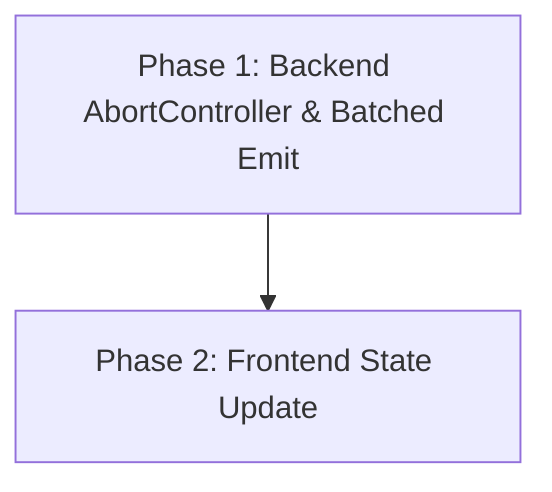

# Implementation Plan: Price Sync Optimization

## Plan Overview
- **Total Phases**: 2
- **Agents Involved**: `coder`
- **Estimated Effort**: Low-Medium (contract change across backend/frontend)

## Dependency Graph

## Execution Strategy Table
| Phase | Stage | Agent | Parallel | Execution Mode | Blocked By |
|-------|-------|-------|----------|----------------|------------|
| 1 | Backend | `coder` | No | Sequential | - |
| 2 | Frontend | `coder` | No | Sequential | 1 |

## Phase Details

### Phase 1: Backend AbortController & Batched Emit
- **Objective**: Implement `AbortController` for the initial fetch and modify the WebSocket connection logic to emit a single batched event.
- **Agent**: `coder`
- **Files to Modify**:
  - `backend/services/FinnhubService.ts`: Update `fetchInitialPrice` to accept an `AbortSignal`. Wrap the `fetch` call in `try...catch` and handle `AbortError` specifically, returning `null`.
  - `backend/sockets/PriceEmitter.ts`: Modify `initializeCache` to accept an optional `AbortSignal`. Update the loop to pass the signal to `FinnhubService.fetchInitialPrice`.
  - `backend/index.ts`: Wrap the `initializeCache` call with an `AbortController`. Set a timeout (e.g., 10 seconds) to abort the initialization if Finnhub is unresponsive.
  - `backend/sockets/SocketServer.ts`: Change the `io.on('connection')` logic. Instead of looping and emitting `priceUpdate`, get all prices and emit a single `initialPrices` event with the array as the payload.
- **Implementation Details**:
  - `initialPrices` payload should be an array of `{ symbol: string, price: number, timestamp: number }`. Note that `getAllLastPrices` currently returns `{ ticker, price }`. It needs to be updated to match the expected frontend structure (which we can align on, but `{ symbol, price, timestamp }` is standard). Currently `getAllLastPrices` in `PriceEmitter` only stores prices. Let's make sure it just sends `{ ticker, price }` or `{ symbol, price }` depending on what frontend expects. We'll stick to `{ symbol, price, timestamp }` by updating `lastPrices` to store the whole object if needed, or simply send the array. Let's just have `getAllLastPrices()` return an array of `{ symbol, price }` based on `lastPrices`.
- **Validation Criteria**: Run `cd backend && npx tsc --noEmit`. 
- **Dependencies**:
  - `blocked_by`: []
  - `blocks`: [2]

### Phase 2: Frontend State Update
- **Objective**: Update the frontend to listen for the new batched event and update the Zustand store efficiently.
- **Agent**: `coder`
- **Files to Modify**:
  - `frontend/src/lib/store.ts`: Add `updateMultiplePrices(prices: { symbol: string, price: number, timestamp?: number }[])` to `MergerStore`. It should iterate over the array and update the state in a single Zustand `set` call.
  - `frontend/src/features/arbitrage/hooks/useMergerWebSocket.ts`: Add a socket listener for `initialPrices` that calls `updateMultiplePrices`.
- **Implementation Details**:
  - The `updateMultiplePrices` action should perform a single `set` mutation containing all the price updates to prevent multiple React re-renders.
  - Ensure the new action checks if the incoming price is newer (or if no price exists) before updating, to prevent overwriting fresh real-time data with stale initial data.
- **Validation Criteria**: Run `cd frontend && npx tsc --noEmit`.
- **Dependencies**:
  - `blocked_by`: [1]
  - `blocks`: []

## File Inventory
| File | Action | Phase | Purpose |
|------|--------|-------|---------|
| `backend/services/FinnhubService.ts` | Modify | 1 | Add AbortSignal to fetch. |
| `backend/sockets/PriceEmitter.ts` | Modify | 1 | Pass AbortSignal, adjust payload. |
| `backend/index.ts` | Modify | 1 | Add AbortController timeout logic. |
| `backend/sockets/SocketServer.ts` | Modify | 1 | Emit batched `initialPrices`. |
| `frontend/src/lib/store.ts` | Modify | 2 | Add `updateMultiplePrices` action. |
| `frontend/src/features/arbitrage/hooks/useMergerWebSocket.ts` | Modify | 2 | Listen for `initialPrices`. |

## Risk Classification
- **Phase 1: MEDIUM**. Modifying the WebSocket event contract requires careful coordination. Handling aborts safely prevents startup crashes.
- **Phase 2: LOW**. Standard React/Zustand state update optimizations.

## Execution Profile
- Total phases: 2
- Parallelizable phases: 0 (in 0 batches)
- Sequential-only phases: 2
- Estimated parallel wall time: N/A
- Estimated sequential wall time: ~4 minutes

## Cost Estimation
| Phase | Agent | Model | Est. Input | Est. Output | Est. Cost |
|-------|-------|-------|-----------|------------|----------|
| 1 | coder | Pro | 2000 | 400 | $0.036 |
| 2 | coder | Pro | 1500 | 300 | $0.027 |
| **Total**| | | **3500** | **700** | **$0.063** |
