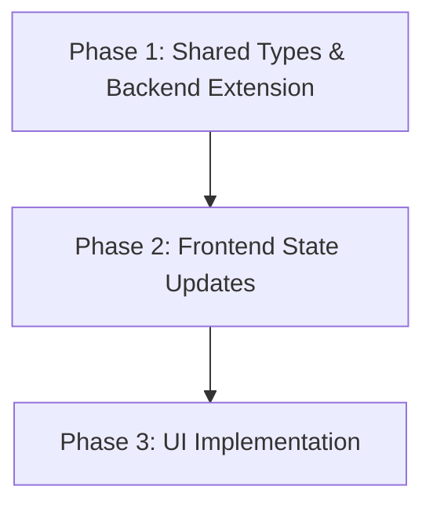

# Product Requirements Document & Implementation Plan: Frontend Last Price Update Timestamp

## 1. Product Requirements (PRD)

### Problem Statement
The `arbiMerge` frontend currently displays real-time price updates for merger targets and acquirers via WebSockets. However, users cannot easily tell when the last price update occurred, which is critical for assessing the freshness of the arbitrage spread calculation. We need to implement a 'Last Price Update' timestamp on the frontend that accurately reflects the time of the trade, relying on data propagated from the backend via the initial REST API response and subsequent WebSocket updates.

### Functional Requirements
- Display the 'Last Price Update' timestamp on the frontend (e.g., in `MergerCard`).
- Provide the timestamp in the initial REST API response (`/api/mergers`).
- Provide the timestamp in real-time WebSocket updates (`PriceUpdate` payload).
- The timestamp should reflect the time of the trade or quote from the exchange (e.g., from `FinnhubService`) when available, otherwise fallback to the time the price was received by the backend.

### Non-Functional Requirements
- The timestamp should be passed as a raw number (milliseconds since epoch) to allow the frontend to format it according to user locale.
- The state management in `useMergerStore` must efficiently update the `lastUpdate` field on the respective `Merger` object without triggering unnecessary re-renders of the entire list.

### Constraints
- Must align with existing data flow: `FinnhubService` -> `PriceEmitter` -> `SocketServer` -> Frontend Store -> UI Components.

### Approach Selected
**Full Data Flow with `lastUpdate` on `Merger`:**
We will extend the `Merger` interface in `packages/frontend/src/features/arbitrage/types.ts` to include a `lastUpdate?: number` property. The backend `PriceEmitter` will expose the last known timestamps, which `server.ts` will inject into the initial `/api/mergers` REST response. The `SocketServer`'s `PriceUpdate` payload will continue to pass the timestamp, and the `useMergerStore` will update the `lastUpdate` field of the `Merger` directly alongside the price.

---

## 2. Implementation Plan

### Plan Overview
- **Total Phases:** 3
- **Agents Involved:** `coder`, `architect`
- **Estimated Effort:** Medium

### Dependency Graph

### Execution Strategy Table
| Stage | Phase | Agent | Description | Execution Mode |
|-------|-------|-------|-------------|----------------|
| Foundation | 1 | `coder` | Extend types and backend API | Sequential |
| State | 2 | `coder` | Update frontend store logic | Sequential |
| UI | 3 | `coder` | Display timestamp in UI | Sequential |

### Phase Details

#### Phase 1: Shared Types & Backend Extension
- **Objective:** Extend the shared `Merger` type to include `lastUpdate` and ensure the backend populates this in the `/api/mergers` endpoint and WebSocket payload.
- **Agent Assignment:** `coder`
- **Files to Modify:**
  - `packages/shared/src/index.ts` (if `Merger` is defined here, otherwise frontend types)
  - `packages/frontend/src/features/arbitrage/types.ts` (add `lastUpdate?: number` to `Merger` and verify `PriceUpdate`)
  - `packages/backend/server.ts` (inject `lastPrices[ticker].timestamp` into the `/api/mergers` response)
  - `packages/backend/sockets/PriceEmitter.ts` (ensure timestamps are tracked correctly)
  - `packages/backend/sockets/SocketServer.ts` (verify timestamp is passed in `emitPriceUpdate`)
- **Implementation Details:**
  - Add `lastUpdate?: number` to the `Merger` interface.
  - In `server.ts`, when mapping the initial mergers list, look up the last known timestamp from `PriceEmitter` and attach it to the target and acquirer prices.
  - Ensure `PriceEmitter` stores timestamps alongside prices (it likely already does).
- **Validation Criteria:**
  - `npm run build` succeeds in backend and frontend.
  - A curl to `/api/mergers` shows the `lastUpdate` field for targets and acquirers if a price exists.
- **Dependencies:** None

#### Phase 2: Frontend State Updates
- **Objective:** Update `useMergerStore` to correctly apply the `lastUpdate` timestamp to the `Merger` objects when prices arrive.
- **Agent Assignment:** `coder`
- **Files to Modify:**
  - `packages/frontend/src/lib/store.ts` (update `updateMergerPrice` to also set `lastUpdate`)
  - `packages/frontend/src/features/arbitrage/hooks/useMergerWebSocket.ts` (ensure the hook passes the timestamp from the socket payload to the store)
- **Implementation Details:**
  - In `updateMergerPrice`, alongside updating `targetPrice` or `acquirerPrice`, update the `lastUpdate` field on the `Merger` object.
  - Ensure the WebSocket hook passes `data.timestamp` to the store's update function.
- **Validation Criteria:**
  - Run frontend dev server, inspect the Zustand store or console logs to verify `lastUpdate` changes on tick.
- **Dependencies:** `blocked_by`: [1]

#### Phase 3: UI Implementation
- **Objective:** Display the localized "Last updated" text on the `MergerCard`.
- **Agent Assignment:** `coder`
- **Files to Modify:**
  - `packages/frontend/src/features/arbitrage/components/MergerCard.tsx`
- **Implementation Details:**
  - Add a small text element (e.g., `text-xs text-slate-500`) showing the last update time.
  - Use `new Date(merger.lastUpdate).toLocaleTimeString()` or a "time ago" utility.
  - Handle the case where `lastUpdate` is undefined (e.g., show "Waiting for update...").
- **Validation Criteria:**
  - Visual verification that the timestamp appears on the card and updates reactively.
- **Dependencies:** `blocked_by`: [2]

### File Inventory
| File | Phase | Action | Purpose |
|------|-------|--------|---------|
| `packages/frontend/src/features/arbitrage/types.ts` | 1 | Modify | Add `lastUpdate` to `Merger` |
| `packages/backend/server.ts` | 1 | Modify | Inject timestamp into REST response |
| `packages/backend/sockets/PriceEmitter.ts` | 1 | Verify | Ensure timestamp is stored |
| `packages/backend/sockets/SocketServer.ts` | 1 | Verify | Ensure timestamp is emitted |
| `packages/frontend/src/lib/store.ts` | 2 | Modify | Update state with timestamp |
| `packages/frontend/src/features/arbitrage/hooks/useMergerWebSocket.ts` | 2 | Modify | Pass timestamp to store |
| `packages/frontend/src/features/arbitrage/components/MergerCard.tsx` | 3 | Modify | Display timestamp in UI |

### Risk Classification
- **Phase 1:** LOW - Straightforward type extension and API payload update.
- **Phase 2:** LOW - Standard Zustand state mutation.
- **Phase 3:** LOW - Simple UI addition.

### Cost Estimation
| Phase | Agent | Model | Est. Input | Est. Output | Est. Cost |
|-------|-------|-------|-----------|------------|----------|
| 1 | `coder` | pro | 2000 | 500 | $0.04 |
| 2 | `coder` | pro | 1500 | 200 | $0.02 |
| 3 | `coder` | pro | 1000 | 200 | $0.01 |
| **Total** | | | **4500** | **900** | **$0.07** |

### Execution Profile
- Total phases: 3
- Parallelizable phases: 0
- Sequential-only phases: 3
- Estimated parallel wall time: N/A
- Estimated sequential wall time: ~4 minutes
