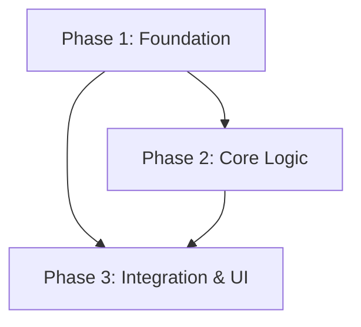

# Implementation Plan: Annualized IRR (TIR) Calculation

**Date**: 2026-03-28
**Status**: Draft
**Task Complexity**: Medium

## 1. Plan Overview

This plan outlines the steps to implement the annualized IRR (TIR) calculation by updating the database schema, implementing the calculation logic in the backend, and displaying the results in the frontend.

| Stage | Phases | Agents | Est. Effort |
|-------|--------|--------|-------------|
| 1. Foundation | 1 | coder | 0.5 days |
| 2. Core Logic | 2 | coder | 0.5 days |
| 3. Integration & UI | 3 | coder | 0.5 days |

## 2. Dependency Graph

## 3. Execution Strategy Table

| Stage | Phase | Agent | Mode | Parallelizable |
|-------|-------|-------|------|----------------|
| 1 | 1 | coder | sequential | No (Foundation) |
| 2 | 2 | coder | parallel | Yes (with P3, but P3 depends on P2 logic) |
| 3 | 3 | coder | sequential | No (Integration) |

## 4. Phase Details

### Phase 1: Foundation (Database & Shared Types)
- **Objective**: Update the Prisma schema and shared frontend types.
- **Agent**: `coder`
- **Files to Modify**:
  - `packages/backend/db/schema.prisma`: Change `expectedClosingDate String?` to `expectedClosingDate DateTime?`.
  - `packages/frontend/src/features/arbitrage/types.ts`: Add `irr?: number` to the `Merger` interface.
- **Implementation Details**:
  - Update `expectedClosingDate` in `schema.prisma`.
  - Run `npx prisma migrate dev --name add_closing_date_datetime` in `packages/backend`.
  - Update the `Merger` type in the frontend to ensure type safety for the new `irr` field.
- **Validation Criteria**:
  - `npx prisma validate` passes.
  - Database migration successful.
  - Frontend types compile without error.
- **Dependencies**: None.

### Phase 2: Core Logic (Backend Calculation)
- **Objective**: Implement and test the annualized IRR calculation.
- **Agent**: `coder`
- **Files to Modify**:
  - `packages/backend/services/SpreadCalculatorService.ts`: Implement `calculateAnnualizedIRR`.
  - `packages/backend/tests/SpreadCalculatorService.test.ts`: Add unit tests for IRR.
- **Implementation Details**:
  - `calculateAnnualizedIRR(spreadPercentage: number, closingDate: Date): number | null`:
    - Calculate `daysToClosing` (today vs closingDate).
    - If `daysToClosing <= 0`, return `null` or 0.
    - Formula: `((1 + spread/100)^(365 / daysToClosing) - 1) * 100`.
    - Round to 2 decimal places.
  - Add test cases for positive spread, negative spread, and same-day closing.
- **Validation Criteria**:
  - `npm test packages/backend/tests/SpreadCalculatorService.test.ts` passes.
- **Dependencies**: Phase 1.

### Phase 3: Integration & UI (Enrichment & Frontend)
- **Objective**: Integrate the IRR into the data flow and display it in the UI.
- **Agent**: `coder`
- **Files to Modify**:
  - `packages/backend/utils/mergerUtils.ts`: Update `enrichMerger` to calculate and include `irr`.
  - `packages/frontend/src/features/arbitrage/components/MergerCard.tsx`: Display the IRR.
- **Implementation Details**:
  - In `enrichMerger`, call `spreadCalculator.calculateAnnualizedIRR(spread, merger.expectedClosingDate)` if the date is present.
  - Update `MergerCard` to show `TIR: [irr]%` in a badge or as a subtitle if `irr` is present.
- **Validation Criteria**:
  - Backend integration test (`npm test packages/backend/tests/mergerUtils.test.ts`) passes.
  - Manual verification of the UI to ensure the IRR is displayed and correctly formatted.
- **Dependencies**: Phase 1, Phase 2.

## 5. File Inventory

| Phase | Action | Path | Purpose |
|-------|--------|------|---------|
| 1 | Modify | `packages/backend/db/schema.prisma` | Change date field type. |
| 1 | Modify | `packages/frontend/src/features/arbitrage/types.ts` | Update shared types. |
| 2 | Modify | `packages/backend/services/SpreadCalculatorService.ts` | Add calculation logic. |
| 2 | Modify | `packages/backend/tests/SpreadCalculatorService.test.ts` | Validate logic. |
| 3 | Modify | `packages/backend/utils/mergerUtils.ts` | Enrich data with IRR. |
| 3 | Modify | `packages/frontend/src/features/arbitrage/components/MergerCard.tsx` | UI display. |

## 6. Risk Classification

| Phase | Risk | Rationale |
|-------|------|-----------|
| 1 | MEDIUM | Database migrations can be risky if existing data is not handled correctly. |
| 2 | LOW | Purely logic-based with unit tests. |
| 3 | LOW | Standard UI update. |

## 7. Execution Profile

- **Total phases**: 3
- **Parallelizable phases**: 0 (sequential flow preferred for clarity)
- **Sequential-only phases**: 3
- **Estimated sequential wall time**: 1.5 days

Note: Native parallel execution currently runs agents in autonomous mode.
All tool calls are auto-approved without user confirmation.

| Phase | Agent | Model | Est. Input | Est. Output | Est. Cost |
|-------|-------|-------|-----------|------------|----------|
| 1 | coder | Flash | 2000 | 500 | $0.005 |
| 2 | coder | Flash | 3000 | 1000 | $0.008 |
| 3 | coder | Flash | 3000 | 1000 | $0.008 |
| **Total** | | | **8000** | **2500** | **$0.02** |
