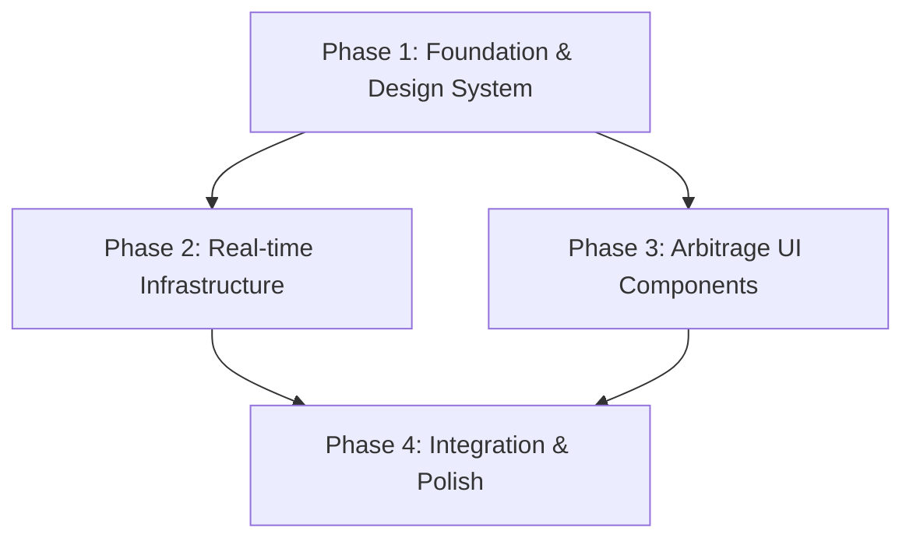

# Implementation Plan: ArbiMerge Frontend

## 1. Plan Overview
This plan outlines the 4-phase implementation of the ArbiMerge frontend monitoring dashboard. We will utilize React 19, Tailwind 4, Zustand for state management, and Socket.io-client for real-time price updates.

-   **Total Phases**: 4
-   **Total Agents**: 4 (design_system_engineer, coder, technical_writer, code_reviewer)
-   **Execution Strategy**: Sequential Foundation, then Parallel Implementation, followed by Polish.

## 2. Dependency Graph

## 3. Execution Strategy Table

| Stage | Phases | Agent(s) | Mode |
|-------|--------|----------|------|
| Foundation | 1 | design_system_engineer | Sequential |
| Core Implementation | 2, 3 | coder, coder | Parallel |
| Finalization | 4 | technical_writer, code_reviewer | Sequential |

## 4. Phase Details

### Phase 1: Foundation & Design System
-   **Objective**: Set up Tailwind 4 tokens and core UI primitives based on `DESIGN.md`.
-   **Agent**: `design_system_engineer`
-   **Files to Create**:
    -   `src/components/ui/Badge.tsx`: Sharp-edged badges for status and deal types.
    -   `src/components/ui/Typography.tsx`: Components for Headline (Space Grotesk) and Body (Inter).
    -   `src/lib/store.ts`: Zustand store definition (`useMergerStore`) with actions for updating prices and handling connection status.
-   **Files to Modify**:
    -   `src/index.css`: Implement `@theme` with color tokens from `DESIGN.md` (Obsidian slates, sharp corners).
-   **Validation**:
    -   `npm run build` (Check Tailwind compilation).
    -   Verify CSS variables in browser inspector.
-   **Risk**: LOW - Standard setup.

### Phase 2: Real-time Infrastructure
-   **Objective**: Implement Socket.io-client integration and WebSocket lifecycle management.
-   **Agent**: `coder`
-   **Files to Create**:
    -   `src/features/arbitrage/hooks/useMergerWebSocket.ts`: Hook to manage socket connection, event listeners, and store updates.
    -   `src/features/arbitrage/types.ts`: TypeScript interfaces for `Merger`, `PriceUpdate`, and `MergerStatus`.
-   **Validation**:
    -   Mock socket server test or manual verification of connection status in the store.
-   **Dependencies**: `blocked_by: [1]`
-   **Risk**: MEDIUM - Socket.io connection resilience and event mapping.

### Phase 3: Arbitrage UI Components
-   **Objective**: Build the visual representation of the merger data.
-   **Agent**: `coder`
-   **Files to Create**:
    -   `src/features/arbitrage/components/MergerCard.tsx`: Individual deal card with flash animations and spread calculation.
    -   `src/features/arbitrage/components/MergerGrid.tsx`: Responsive grid for cards.
    -   `src/features/arbitrage/components/Dashboard.tsx`: Root feature component coordinating data fetch and WebSocket hook.
-   **Files to Modify**:
    -   `src/App.tsx`: Replace skeleton with `Dashboard`.
-   **Validation**:
    -   Component rendering check.
    -   Verify visual flash on mock state update.
-   **Dependencies**: `blocked_by: [1]`
-   **Risk**: LOW - Primarily UI/UX implementation.

### Phase 4: Integration & Polish
-   **Objective**: Final wiring, documentation, and quality review.
-   **Agent**: `technical_writer`, `code_reviewer`
-   **Files to Modify**:
    -   `README.md`: Document the new architecture and how to run.
-   **Files to Create**:
    -   `docs/architecture.md`: Detail the state flow and design system integration.
-   **Validation**:
    -   `npm run lint`
    -   End-to-end manual walkthrough of the dashboard.
-   **Dependencies**: `blocked_by: [2, 3]`
-   **Risk**: LOW.

## 5. File Inventory

| Path | Phase | Action | Purpose |
|------|-------|--------|---------|
| `src/index.css` | 1 | Modify | Tailwind 4 configuration and global styles |
| `src/components/ui/Badge.tsx` | 1 | Create | Reusable sharp badges |
| `src/components/ui/Typography.tsx` | 1 | Create | Font family wrappers |
| `src/lib/store.ts` | 1 | Create | Zustand state management |
| `src/features/arbitrage/types.ts` | 2 | Create | Shared domain types |
| `src/features/arbitrage/hooks/useMergerWebSocket.ts` | 2 | Create | Real-time connection logic |
| `src/features/arbitrage/components/MergerCard.tsx` | 3 | Create | Individual deal component |
| `src/features/arbitrage/components/MergerGrid.tsx` | 3 | Create | Layout for merger cards |
| `src/features/arbitrage/components/Dashboard.tsx` | 3 | Create | Feature entry point |
| `src/App.tsx` | 3 | Modify | Main entry point integration |
| `README.md` | 4 | Modify | Project documentation |

## 6. Execution Profile
-   **Total phases**: 4
-   **Parallelizable phases**: 2 (Phase 2 and 3)
-   **Sequential-only phases**: 2
-   **Estimated parallel wall time**: 3 implementation turns.

## 7. Cost Estimation

| Phase | Agent | Model | Est. Input | Est. Output | Est. Cost |
|-------|-------|-------|-----------|------------|----------|
| 1 | design_system_engineer | Pro | 3,000 | 1,000 | $0.07 |
| 2 | coder | Pro | 4,000 | 1,500 | $0.10 |
| 3 | coder | Pro | 5,000 | 2,500 | $0.15 |
| 4 | technical_writer | Flash | 6,000 | 1,500 | $0.01 |
| **Total** | | | **18,000** | **6,500** | **$0.33** |
